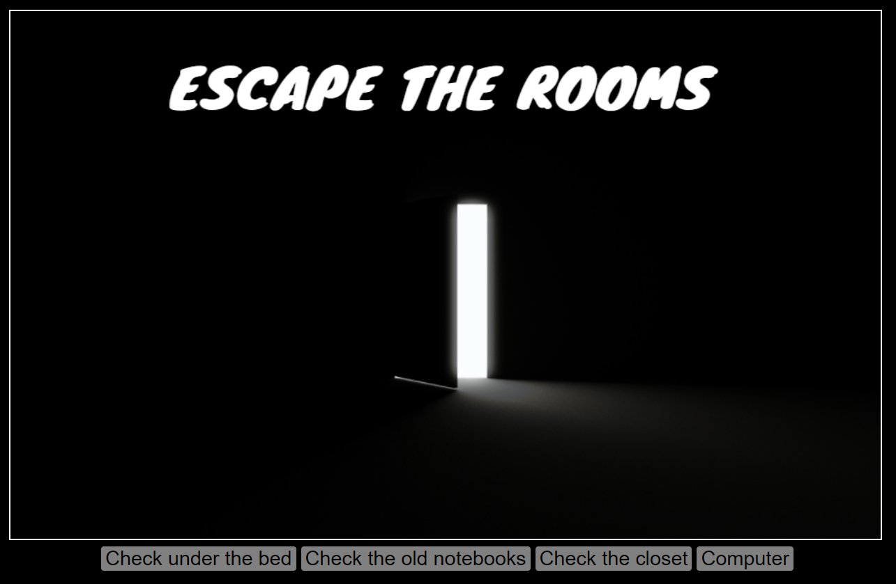

# EscapeTheRoomsRemaster

In this game you will explore multiple rooms in order to find passwords.

To find those passwords you'll have to find clues and solve puzzles.

# Origin

The first idea for this game started during an end of season special @ <Academia de Código_> where we had to code a game that would be played using the terminal.

I'm recreating the game but now utilizing different technologies.

# Technologies
  - HTML
  - CSS
  - JavaScript

# Screenshots

  Since there are no images yet, the main page image appears everywhere at the moment.
 
 
 ---
 
 ---
 
 ---
 
 
 
